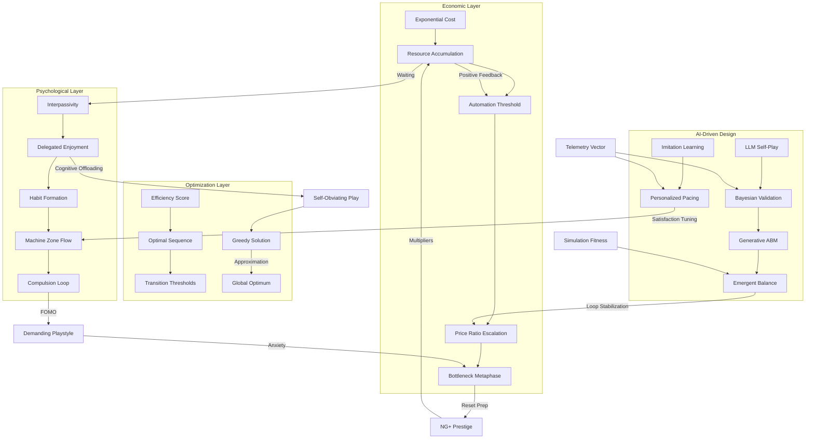

# HFS Ontology Graph (v2.1)
*Hardened Knowledge Architecture Visualization*

## Graph Key & Traceability

### 1. The Growth Loop (Economy)
- **C1 -> C4:** The standard exponential decay of player efficiency over time (Demaine 2018).
- **B1:** The transition point where storage or patience fails (Alharthi 2017).

### 2. The Trance Loop (Psychology)
- **I1 -> MZ:** The core "Machine Zone" where interpassivity yields enjoyment through delegated play (Fizek 2018, Schmalzer 2019).
- **C5:** The "Demanding" edge case where FOMO breaks the trance (Larsson 2018).

### 3. The Strategy Loop (Optimization)
- **ES -> OG:** The mathematical proof that local greedy efficiency converges to global optimality for large goals (Demaine 2018).
- **S1:** The phenomenon where expert play requires *less* interaction (Alharthi 2017).

### 4. The Hardened AI Loop (Modern)
- **LLM -> EB:** Using multi-agent simulation to discover Nash equilibria in high-dimensional rule spaces (RuleSmith 2026, GEEvo 2026).
- **IL -> PA:** Personalized pacing to keep the player in the Machine Zone (PDDA 2026).
- **TV:** The live "Vector" stack informing all balance adjustments (Unity 2026).
